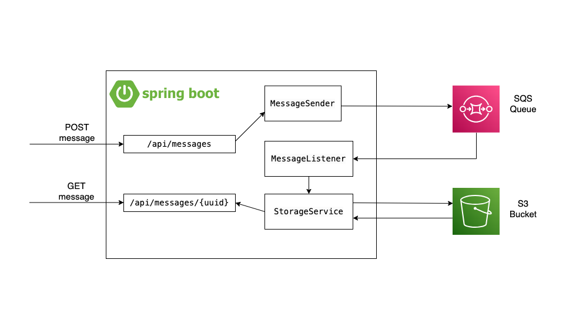

# Running & Testing a Full Backend Application Using Gradle and LocalStack

## Introduction

In modern software development, it's common to juggle multiple tools to manage, build, and test backend applications. 
However, achieving a streamlined workflow is critical for maintaining productivity and reducing friction. 
In this post, we'll explore how to use Gradle as the central orchestrator for building and running a Spring Boot application, creating infrastructure with Pulumi for Java, and testing using LocalStack. 
We'll focus on how Gradle and LocalStack work together to provide a seamless experience from local development to cloud deployment.

## Prerequisites

Make sure you have the following installed:
- Java 17+
- A [compatible Docker environment](https://www.testcontainers.org/supported_docker_environment/)
- Gradle
- `pulumi` & `pulumilocal`

## Setting Up the Project

To begin, let's set up our project structure. 
We'll use Gradle to manage dependencies, tasks, and the overall build process.
The key components include:

- Spring Boot Application: This serves as our backend service.
- Pulumi for Java: Used to define and create AWS infrastructure.
- LocalStack with Testcontainers: A framework providing a fully functional local AWS cloud stack that allows us to emulate AWS services during testing.

The `build.gradle` file will include the necessary dependencies for Spring Boot, Pulumi, LocalStack, and Testcontainers.

## Creating Infrastructure with Pulumi

Pulumi allows us to define and manage cloud infrastructure using familiar programming languages. 
In this project, we'll use Pulumi for Java to create necessary AWS resources, such as an S3 bucket and an SQS queue. 
These resources will be provisioned locally using LocalStack during the testing phase.

Let's define the infrastructure using Pulumi within a dedicated Gradle task. 
This task will automate the creation of the infrastructure every time we run our application. 
We have two options here, defining a task for local resources and telling our application what endpoints to use, and a second task for real AWS resources and defaulting to our preconfigured clients.

```groovy
task initStack(type: Exec) {
    commandLine 'pulumilocal', 'stack', 'init', 'dev'
}

task createStack(type: Exec) {
    commandLine 'pulumilocal', 'up', '--yes', '--stack', 'dev'
}
```

These tasks will pair with the `local` profile where we configure the LocalStack endpoints:

```groovy
task runSpringBootAppWithLocalStack(type: JavaExec) {
    description = 'Run the Spring Boot application'
    classpath = sourceSets.main.runtimeClasspath
    mainClass = 'app.Application'
    args = ['--spring.profiles.active=local']
}
```

Our endpoints will be defined as such in the `application-local.properties` file:

```properties
spring.cloud.aws.endpoint=http://localhost.localstack.cloud:4566
spring.cloud.aws.s3.endpoint=http://s3.localhost.localstack.cloud:4566
```

If we want to run our application using the AWS cloud platform, our options are as following:

```groovy
task initStack(type: Exec) {
    commandLine 'pulumi', 'stack', 'init', 'dev'
}

task createStack(type: Exec) {
    commandLine 'pulumi', 'up', '--yes', '--stack', 'dev'
}
```

And our application will start with the default configurations:

```groovy
task runSpringBootApp(type: JavaExec) {
    description = 'Run the Spring Boot application'
    classpath = sourceSets.main.runtimeClasspath
    mainClass = 'app.Application'
}
```

The ApplicationStack class will contain the Pulumi code to define and create the resources:

```java
public class ApplicationStack {
    public static void main(String[] args) {

        Pulumi.run(ApplicationStack::createResources);
    }
    private static void createResources(Context ctx) {
        AwsConfig config = YamlConfigLoader.loadConfig("application.yml");

        var bucket = new Bucket(config.getBucket(),
                BucketArgs.builder()
                        .bucket(config.getBucket())
                        .forceDestroy(true)
                        .build());
        ctx.export("bucketArn", bucket.arn());

        var queue = new Queue(config.getQueue() + ".fifo", QueueArgs.builder()
                .name(config.getQueue() + ".fifo")
                .fifoQueue(true)
                .contentBasedDeduplication(true)
                .build());

        ctx.export("queueUrl", queue.url());

    }
}
```
This setup ensures that every time we run the `createStack` task, our S3 bucket and SQS queue will be provisioned, either on AWS or locally with LocalStack.

## Building and Running the Spring Boot Application

In a nutshell, the Spring Boot application can be described by the following diagram:



With our infrastructure in place, the next step is to build and run our Spring Boot application. 
Gradle makes this straightforward, handling dependency management, building, and running the application.
We have already defined the Gradle task for building the application.

## Testing with LocalStack

Testing is a critical phase where LocalStack proves invaluable. 
LocalStack allows us to emulate AWS services locally, ensuring that our Spring Boot application interacts correctly with the infrastructure before deploying to the real AWS environment.

We’ll set up our tests to use LocalStack, making sure they interact with the local versions of the AWS services.
Gradle will orchestrate the test execution, tying it all together.

There are two major focus points of our tests: infrastructure and application. 
The great thing about Pulumi allowing us to define our infrastructure using one of the most popular programming languages is the possibility to include this process in our test suites, just like any other part of an application.

Here's an example of a test that verifies the existence of the S3 bucket we provisioned:

```java
@Testcontainers
public class IaCStackTest {

    private static final String STACK_NAME = "dev";

    @Container
    public static LocalStackContainer localStack = new LocalStackContainer(DockerImageName.parse("localstack/localstack:3.5.0"))
            .withServices(LocalStackContainer.Service.S3, LocalStackContainer.Service.SQS);

    static File WORK_DIR;

    private S3Client s3Client;

    static {
        localStack.start();
    }

    @Before
    public void setup() throws IOException {
        URI lsEndpoint = localStack.getEndpoint();
        WORK_DIR = new File(".");
        PulumiLocalStackAdapter.configure(localStack, STACK_NAME, WORK_DIR);

        AwsBasicCredentials awsCreds = AwsBasicCredentials.create("test", "test");

        s3Client = S3Client.builder()
                .credentialsProvider(StaticCredentialsProvider.create(awsCreds))
                .endpointOverride(lsEndpoint)
                .region(Region.of("us-east-1"))
                .build();
    }


    @Test
    public void testBucketCreation() throws IOException, InterruptedException {

        PulumiLocalStackAdapter.init(WORK_DIR);

        PulumiLocalStackAdapter.up(WORK_DIR);


        var buckets = s3Client.listBuckets().buckets();
        assertTrue(buckets.stream().anyMatch(b -> b.name().equals("6578-demo-message-bucket")));

        PulumiLocalStackAdapter.clean(WORK_DIR);

    }
}
```

The `IaCStackTest` class is a test class that uses the Testcontainers framework to run integration tests against AWS services simulated by LocalStack.
The class is annotated with `@Testcontainers`, indicating that it uses containerized services for testing.

Within the class, a static instance of `LocalStackContainer` is created and configured to run LocalStack with S3 and SQS services enabled.
The container is started before any tests run, ensuring that the necessary AWS services are available for testing. 

The setup method, annotated with `@Before`, is executed before all the tests. 
It sets up the S3 client with credentials and points it to the LocalStack endpoint, preparing the environment for testing.

The `testBucketCreation` method is a test that verifies the creation of an S3 bucket using Pulumi with LocalStack.
The method first initializes the Pulumi stack and then runs it to create the infrastructure defined in the Pulumi code.
Afterward, the test checks whether the specified S3 bucket ("6578-demo-message-bucket") exists in the LocalStack environment. 
Finally, the method cleans up the Pulumi stack to reset the environment.

This class effectively demonstrates how to use Pulumi with LocalStack for testing Infrastructure as Code (IaC) in a controlled and isolated environment.

The other equally important part of this operation is testing the application's behaviour.

```java
@Testcontainers
@SpringBootTest(classes = app.Application.class, 
        webEnvironment = SpringBootTest.WebEnvironment.DEFINED_PORT, properties = {
        "server.port=8080"})
@RunWith(SpringRunner.class)
@ExtendWith(SpringExtension.class)

public class ApplicationTest {

    private final TestRestTemplate restTemplate= new TestRestTemplate();

    private static final String STACK_NAME = "dev";

    static File WORK_DIR;

    @Container
    public static LocalStackContainer localStack = new LocalStackContainer(DockerImageName.parse("localstack/localstack:3.5.0"))
            .withServices(LocalStackContainer.Service.S3, LocalStackContainer.Service.SQS);

    static {
        localStack.start();
    }

    @DynamicPropertySource
    static void dynamicProperties(DynamicPropertyRegistry registry) {
        registry.add("spring.cloud.aws.endpoint", () -> localStack.getEndpoint());
        registry.add("spring.cloud.aws.s3.endpoint", () -> localStack.getEndpoint());
    }
    @Before
    public void setup() throws IOException, InterruptedException {
        URI lsEndpoint = localStack.getEndpoint();
        WORK_DIR = new File(".");
        PulumiLocalStackAdapter.configure(localStack, STACK_NAME, WORK_DIR);

        PulumiLocalStackAdapter.init(WORK_DIR);

        PulumiLocalStackAdapter.up(WORK_DIR);
    }

    @After
    public void tearDown() throws IOException, InterruptedException {
        PulumiLocalStackAdapter.clean(WORK_DIR);
    }

    @Test
    public void testPostAndGetMessage() throws IOException, InterruptedException {
        // Create a unique UUID and the message content
        UUID uuid = UUID.randomUUID();
        String content = "Hello, World!";

        // Define the message object
        Message message = new Message(uuid, content);

        // Define the URL for the POST request
        String postUrl = "http://localhost:8080/api/messages";

        // Send the POST request to save the message
        HttpHeaders headers = new HttpHeaders();
        headers.setContentType(MediaType.APPLICATION_JSON);
        HttpEntity<Message> request = new HttpEntity<>(message, headers);
        ResponseEntity<String> postResponse = restTemplate.exchange(postUrl, HttpMethod.POST, request, String.class);

        // Assert that the POST request was successful (HTTP 201 Created)
        assertThat(postResponse.getStatusCode().is2xxSuccessful()).isTrue();

        // Define the URL for the GET request
        String getUrl = "http://localhost:8080/api/messages/" + uuid;

        // Send the GET request to retrieve the message
        ResponseEntity<java.util.Map> getResponse = restTemplate.exchange(getUrl, HttpMethod.GET, null, java.util.Map.class);

        // Assert that the GET request was successful and the content matches
        assertThat(getResponse.getStatusCode().is2xxSuccessful()).isTrue();
        assertThat(getResponse.getBody().get("content")).isEqualTo(content);
    }
}
```

The `ApplicationTest` class is a comprehensive test class that integrates Spring Boot with Testcontainers and LocalStack to test the functionality of a backend application in an AWS environment.
This class is annotated with `@SpringBootTest`, meaning it will load the full application context for testing, and it runs on a defined port, ensuring that the web environment is set up correctly.

The class utilizes `TestRestTemplate` for making HTTP requests to the application, mimicking client behavior.
A static LocalStackContainer is set up to emulate AWS services.
The infrastructure is initialized and provisioned using Pulumi before the tests, ensuring that the necessary resources are available.

The `testPostAndGetMessage` method is a core test that verifies the application's ability to handle POST and GET requests for messages. 
It simulates the complete flow of creating a message via a POST request and retrieving it via a GET request, asserting that the operations are successful and the data is correctly handled.

This test demonstrates how to effectively test a Spring Boot application in a controlled environment that closely mirrors production, leveraging the power of Spring Boot, Pulumi, and LocalStack together.

## Bringing It All Together

By integrating Gradle with Pulumi and LocalStack, we create a robust development and testing pipeline. 
Each component plays a crucial role:

- Gradle: Orchestrates tasks, managing dependencies, building, and running the application.
- Pulumi: Manages infrastructure as code, seamlessly integrated into the build process.
- LocalStack: Emulates AWS services for local testing and development, ensuring consistency before deployment.

This streamlined process reduces friction, accelerates development, and ensures a smooth transition from local development to production deployment.

## Conclusion

By leveraging Gradle, Pulumi, and LocalStack together, we create a powerful and efficient workflow for backend development.
This approach not only simplifies the management of complex tasks but also ensures reliable testing in an environment that mirrors production. 
With this setup, you can confidently build, run, and test your applications, knowing they will perform as expected when deployed to the cloud.


